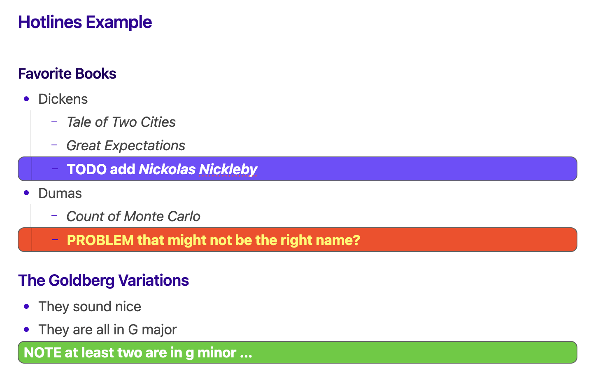
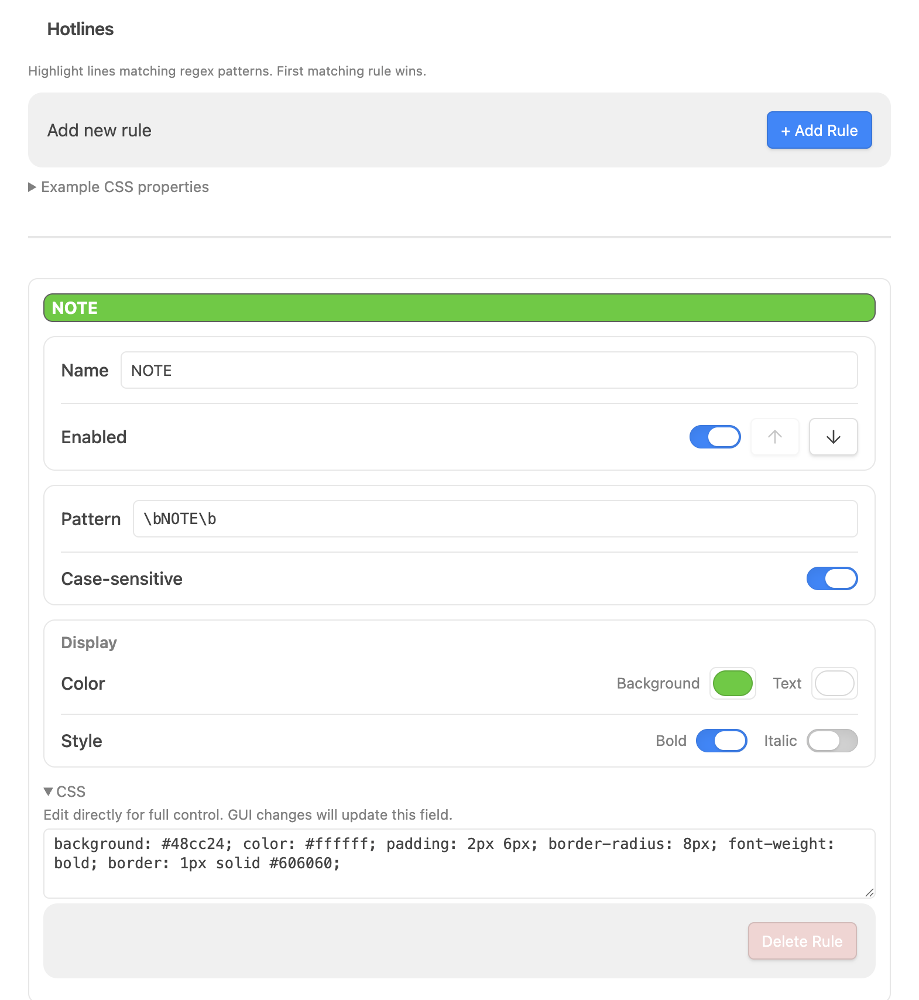
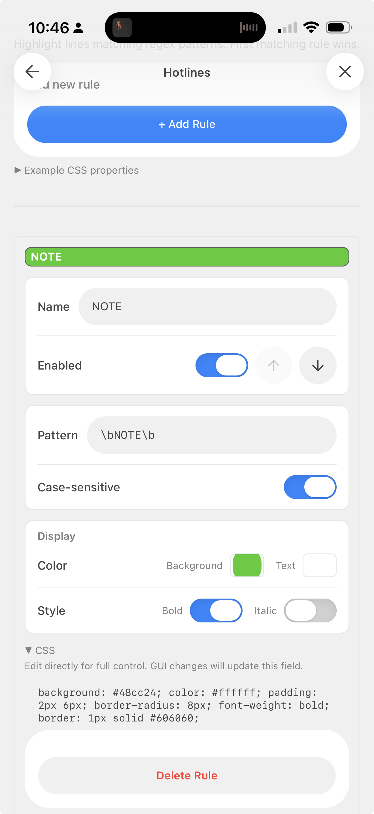

# 🖍️ Hotlines

Highlight whole lines in your notes that match keywords or regex patterns — with custom background, text color, weight, and CSS. Great for making `TODO`, `PROBLEM`, `IMPORTANT`, or any marker you use jump off the page.

Works in both Reading Mode and Live Preview, on desktop and mobile.



I like the [aDHL plugin](https://github.com/tine-schreibt/aDHL); Hotlines is simpler but adds the ability to style with any custom CSS (in particular I wanted to customize the *font* color as well as the background). aDHL adds lots of other nice features though—check it out too.

---

## Features

- **Regex or keyword matching** — each rule highlights any line containing a match.
- **Full-row highlight** — the background spans the whole row, not just the matched word, while bullets, list indentation, and dashes keep rendering on top.
- **Reading mode and Live Preview** — consistent look in both, including inside **callouts**, **soft-wrapped paragraphs**, **list items**, and **plain code blocks**.
- **Per-rule styling** — background color, text color, bold, italic, and a full **custom CSS** field for anything else (borders, radius, underline, opacity…).
- **First matching rule wins** — order your rules to control precedence.
- **Mobile-friendly settings** — grouped, touch-sized controls.

---

## Screenshots

**Settings — rule editor**



**Mobile settings**



---

## Installation

### Manual

1. Create a folder named `hotlines` in your vault's `.obsidian/plugins/` directory.
2. Copy `main.js` and `manifest.json` into it.
3. In Obsidian, open **Settings → Community plugins**, enable **Hotlines** (you may need to reload or toggle "Restricted mode" off first).

> [!NOTE]
> The plugin ships with four starter rules — `NOTE`, `PROBLEM`/`BUG`, `TODO`, and `CONTINUE` — which you can edit or delete.

---

## Usage

Open **Settings → Community plugins → Hotlines** to manage rules.

Each rule has:

| Field | What it does |
|-------|--------------|
| **Name** | A label for the rule (shown on the colored preview bar). |
| **Enabled** | Toggle the rule on/off. Use the **↑ / ↓** buttons to reorder — earlier rules win on a line that matches more than one. |
| **Pattern** | A (JavaScript) regular expression (no slashes needed, so you can also just put a keyword here). Any line whose text matches gets highlighted. |
| **Case-sensitive** | When off, matching ignores case. |
| **Color** | Background and text colors (color pickers). |
| **Style** | Bold and/or italic. |
| **CSS** | The raw CSS applied to the highlight. The color/style controls write into this; you can also edit it directly for full control. |

### Simple example patterns

| Goal | Pattern |
|------|---------|
| The word `TODO` | `\bTODO\b` |
| `PROBLEM` or `BUG` | `\b(PROBLEM\|BUG)\b` |
| `TODO next` (with whitespace) | `\bTODO\s+next\b` |
| A `@mention` | `@\w+` |
| Lines starting with `!` | `^\s*!` |

---

## Custom CSS

The **CSS** field (collapsible, under each rule) holds the exact style applied to matching rows. The GUI controls edit only their own property, so anything else you add by hand is preserved when you tweak a color or toggle bold.

Some properties you can drop in:

```css
background: #2563eb;
color: #ffffff;
font-weight: bold;
font-style: italic;
padding: 2px 6px;
border-radius: 8px;
border: 1px solid #606060;
border-left: 4px solid #fbbf24;
text-decoration: underline;
opacity: 0.9;
```

> [!NOTE]
> In Live Preview, layout-shifting properties (`padding`/`margin`) are stripped automatically so they don't disturb list indentation or the editor cursor — the row still gets its full-width background.

---

## Behavior notes

- **Callouts & soft-wrapped paragraphs** — only the matching line is highlighted, not the whole block.
- **Lists** — the highlight spans the full row and the bullet sits on it; sibling bullets stay aligned.
- **Plain code blocks** (no language) — only the matching line(s) are highlighted.
- **Language-tagged code blocks** (e.g. ` ```cpp `) are **intentionally not highlighted** — syntax highlighting splits each line into many tokens, so reliable per-line matching isn't possible there.

---

## Compatibility

- Desktop and mobile (`isDesktopOnly: false`).
- Tested against Obsidian's default theme and Minimal; custom themes should generally work, but very custom list/callout styling may affect spacing.

---

## License

MIT — do what you like.

## Author

Steve Crutchfield — [@crufi](https://github.com/crufi)
